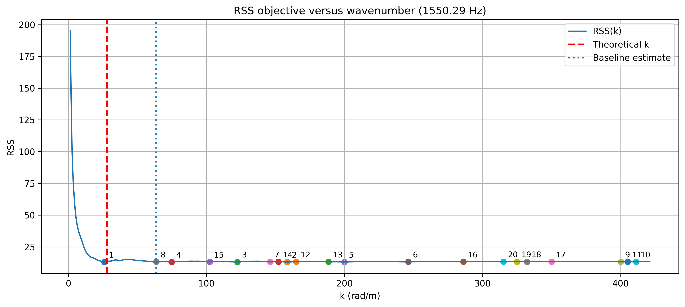
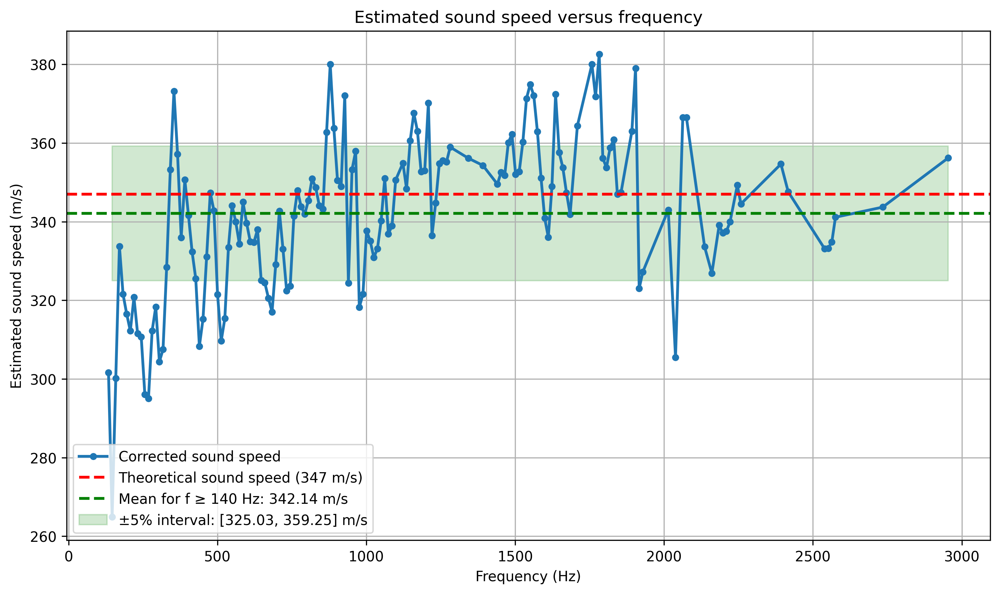
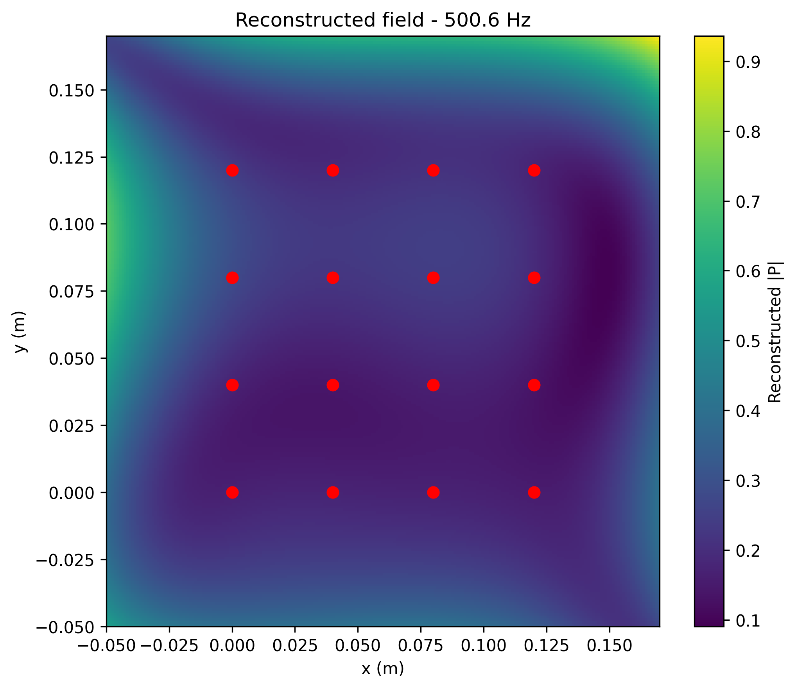
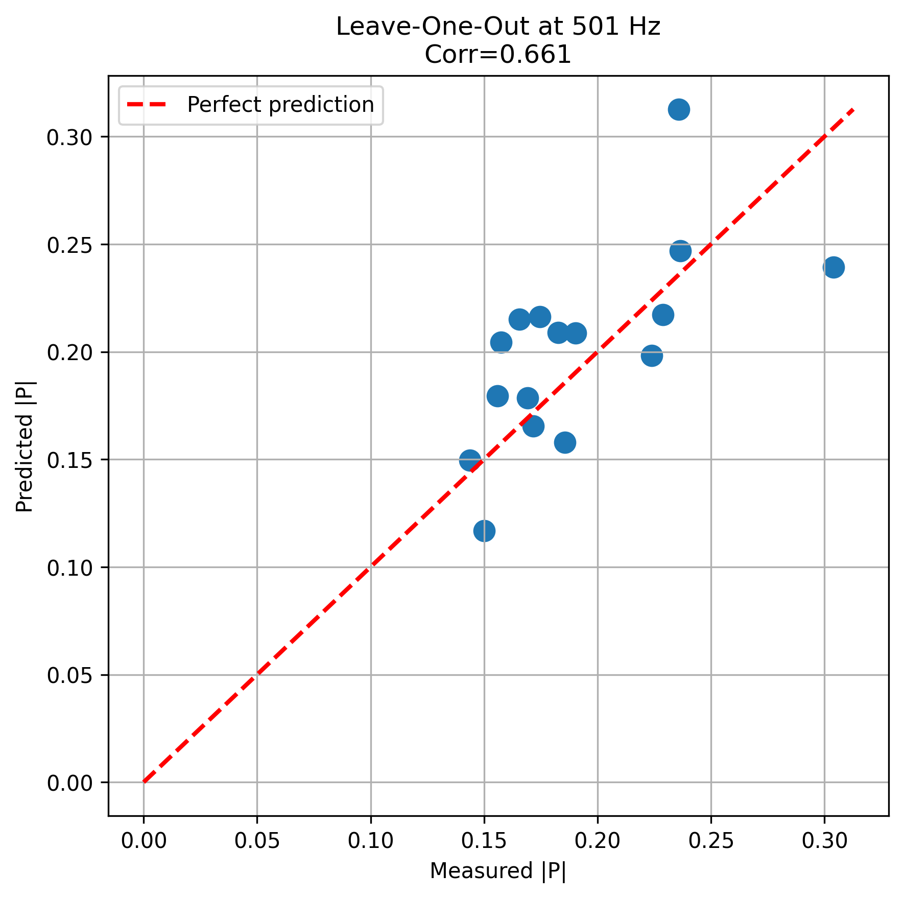

# Acoustic Parameter Estimation from Spatial Correlations

Estimation of acoustic parameters from microphone-array measurements using spatial coherence, nonlinear optimization, and Gaussian-process regression.

The project studies how the speed of sound can be inferred from measured spatial correlations, why the resulting inverse problem becomes difficult at high frequencies, and how alternative estimators behave when the standard least-squares approach becomes unreliable.

The implementation is built around reproducible numerical experiments on planar and three-dimensional microphone arrays.

## Overview

For a diffuse acoustic field, the spatial coherence between two microphones separated by a distance \(r\) is modeled by

\[
\Gamma(r,f) \approx \frac{\sin(kr)}{kr},
\]

where \(k\) is the acoustic wavenumber. At each frequency, \(k\) is estimated by minimizing

\[
RSS(k)
=
\sum_{i<j}
\left[
\widehat{\Gamma}_{ij}(f)
-
\frac{\sin(k r_{ij})}{k r_{ij}}
\right]^2.
\]

The corresponding sound-speed estimate is then

\[
\hat c(f)=\frac{2\pi f}{\hat k(f)}.
\]

This works well over a substantial part of the spectrum, but the objective becomes strongly multimodal at higher frequencies. A bounded scalar optimizer may then converge to a physically incorrect local minimum even when another minimum lies close to the theoretical wavenumber.

The project therefore investigates the geometry of the RSS objective itself, compares several high-frequency estimators, and evaluates a local-minimum selection strategy on a 24-microphone array.

## Method

### Spatial-coherence estimation

The signal-processing pipeline computes cross-spectral matrices from multichannel recordings, converts them to coherence matrices, groups microphone pairs by their spatial separation, and fits the diffuse-field sinc model frequency by frequency.

The same pipeline is used across several UMA16 experiments and a custom 24-microphone three-dimensional array.

### Multimodal RSS landscape

At high frequencies, the RSS objective can contain many competing local minima. The figure below shows a representative landscape for the 24-microphone experiment.



Rather than treating the optimizer as a black box, the code explicitly evaluates \(RSS(k)\), detects and refines its local minima, and compares their locations with the physically expected wavenumber.

For the 24-microphone experiment, estimates whose baseline wavenumber differs by more than 5% from the theoretical value are corrected by selecting the local RSS minimum closest to that value.

### Alternative high-frequency estimators

Two additional estimators were investigated on the UMA16 data:

- a **piecewise-affine approximation** of the RSS landscape, using its estimated breakpoint;
- a **second-derivative estimator**, based on the location of the maximum of \(RSS''(k)\).

These methods are retained in the repository even though they do not provide satisfactory high-frequency sound-speed estimates. Their mean estimates above approximately 1.5 kHz are respectively about 384.6 m/s and 671.8 m/s.

Keeping these negative results was useful: they show that identifying a visually meaningful feature of the objective is not sufficient to obtain a physically meaningful estimator.

### Gaussian-process field reconstruction

The project also reconstructs a complex acoustic pressure field from the 16 UMA16 measurements using a Gaussian process with the same diffuse-field covariance structure,

\[
K(r)=\frac{\sin(kr)}{kr}.
\]

At approximately 500 Hz, the GP predicts the complex pressure over a \(220\times220\) spatial grid and provides a predictive uncertainty estimate.

Leave-one-out cross-validation is used to assess reconstruction quality independently at each microphone location.

## Results

The main numerical results are summarized below.

| Experiment | Result |
|---|---:|
| UMA16 retained-band mean sound speed | **345.50 m/s** |
| UMA16 retained-band interval (±5%) | **[328.23, 362.78] m/s** |
| 24-microphone corrected mean sound speed | **342.14 m/s** |
| 24-microphone interval (±5%) | **[325.03, 359.25] m/s** |
| GP leave-one-out correlation | **0.661** |
| GP leave-one-out NRMSE | **0.316** |

For UMA16, the retained frequency band starts at the first available frequency whose estimated sound speed exceeds 300 m/s and ends at 1.5 kHz.

For the 24-microphone experiment, the local-minimum correction is applied globally for the final summary, while the reported mean is computed from frequencies above 140 Hz.



The correction substantially reduces the high-frequency failures of the baseline bounded minimization while preserving the original sinc-based physical model.

The Gaussian-process reconstruction provides a separate view of the spatial information contained in the array measurements:



Its leave-one-out validation gives a magnitude correlation of approximately 0.66:



## Repository structure

```text
.
├── src/acoustic_estimation/
│   ├── estimation.py          # sinc fitting, RSS analysis and estimators
│   ├── gaussian_process.py    # complex GP reconstruction and LOOCV
│   ├── geometry.py            # microphone-array geometries
│   ├── io.py                  # data loading
│   ├── models.py              # acoustic models
│   ├── plotting.py            # diagnostic and publication figures
│   ├── results.py             # result serialization
│   └── spectral.py            # spectra, CSM and coherence estimation
│
├── scripts/                   # command-line analysis workflows
├── tests/                     # numerical and regression tests
├── results/                   # versioned reference outputs and figures
└── docs/
    ├── report_fr.pdf
    └── presentation_fr.pdf
```

## Installation

Python 3.10 or later is required.

```bash
git clone <repository-url>
cd acoustic-parameter-estimation-from-spatial-correlations

python -m pip install -e ".[dev]"
```

The main dependencies are NumPy, SciPy and Matplotlib.

## Reproducing the analyses

Reference numerical outputs are versioned under `results/`, so the main results and figures can be inspected without the original recordings.

### UMA16

An UMA16 experiment can be processed from its 16 WAV recordings with

```bash
python scripts/analyze_uma16.py /path/to/recording-directory \
  --output results/uma16/<experiment>/analysis.npz \
  --figures-dir results/uma16/<experiment>/figures \
  --diagnostics
```

For the CROUS experiment, the two alternative high-frequency RSS estimators are reproduced with

```bash
python scripts/apply_uma16_piecewise.py \
  results/uma16/crous/analysis.npz \
  --output results/uma16/crous/piecewise_affine.npz

python scripts/apply_uma16_second_derivative.py \
  results/uma16/crous/analysis.npz \
  --output results/uma16/crous/second_derivative.npz
```

The corresponding RSS-shape diagnostics at the first frequency above 1.5 kHz can be generated with

```bash
python scripts/analyze_rss_shape.py \
  results/uma16/crous/analysis.npz \
  1528.86 \
  --output-directory results/uma16/crous/rss_shape
```

### 24-microphone array

The baseline pipeline takes the original 24-channel NumPy acquisition:

```bash
python scripts/analyze_array24.py /path/to/array24_recording.npy \
  --output results/array24/baseline.npz
```

The high-frequency local-minimum correction is then reproduced with

```bash
python scripts/correct_array24_minima.py \
  results/array24/baseline.npz \
  --output results/array24/local_minima_corrected.npz \
  --figure results/array24/figures/sound_speed_local_minima_correction.png
```

For the final broadband summary, the same correction is applied across the full frequency range:

```bash
python scripts/correct_array24_minima.py \
  results/array24/baseline.npz \
  --frequency-switch 0 \
  --output results/array24/global_local_minima_corrected.npz
```

Individual RSS landscapes can also be inspected with `scripts/analyze_rss_landscape.py`.

The final UMA16 and 24-microphone sound-speed summaries are generated with

```bash
python scripts/plot_final_sound_speed_summary.py
```

### Gaussian-process reconstruction

With the original 16 CROUS recordings available locally:

```bash
python scripts/reconstruct_uma16_field.py \
  /path/to/Measured_sounds_1_crous
```

This exports the complex reconstructed field, predictive uncertainty, leave-one-out predictions, and validation metrics.

The six GP diagnostic figures can then be regenerated directly from the saved reconstruction:

```bash
python scripts/plot_uma16_gp_reconstruction.py
```

## Testing

The numerical pipeline is covered by **117 automated tests**, including tests for spectral processing, microphone geometry, sinc fitting, local-minimum detection and refinement, high-frequency estimators, plotting, the 24-microphone correction, and Gaussian-process reconstruction.

Run the complete suite with

```bash
python -m pytest -q
```

The refactored implementations were also checked against the original research scripts during development, including full-field GP reconstruction and the high-frequency UMA16 estimators.

## Experimental data

The original experimental recordings are not distributed with this repository.

Versioned reference outputs are provided under `results/`, allowing the numerical results and figures to be inspected and regenerated without the raw recordings. The analysis scripts can also process the original recordings when they are available.

## Report and presentation

The original project documentation is available in French:

- [`docs/report_fr.pdf`](docs/report_fr.pdf)
- [`docs/presentation_fr.pdf`](docs/presentation_fr.pdf)

These documents contain the experimental context, derivations and discussion underlying the implementation in this repository.

## Authors

* Malek Aït-Mokhtar
* Malo Bonnefoy
* Antoine Bonnin
* Abdessellam Garrou
* Antoine Maillet

Project supervised by **Gilles Chardon**

Université Paris-Saclay · CentraleSupélec · Laboratoire des Signaux et Systèmes (L2S)

